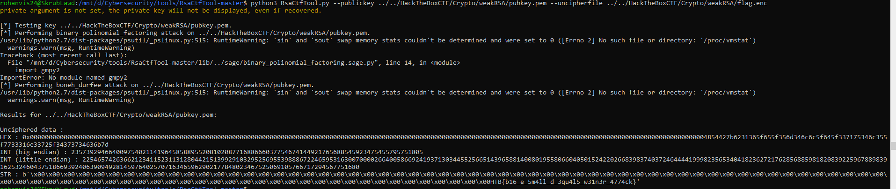

When I heard "weak RSA," the first thing to pop into my mind was that the n value was factorable in a feasible amount of time. 
Looking into how people have done this in the past, I ran into this incredibly useful tool at: https://github.com/Ganapati/RsaCtfTool.
It performs multiple attacks on the RSA file to try and crack it. 

I ran the command 
```
python3 RsaCtfTool.py --publickey ../../HackTheBoxCTF/Crypto/weakRSA/pubkey.pem --uncipherfile ../../HackTheBoxCTF/Crypto/weakRSA/flag.enc
```
to run the program against the file.

In this case, the binomial polynomial factoring attack was successful at cracking the public key.


At the end of the STR line, we can clearly see the flag: HTB{b16_e_5m4ll_d_3qu4l5_w31n3r_4774ck}
