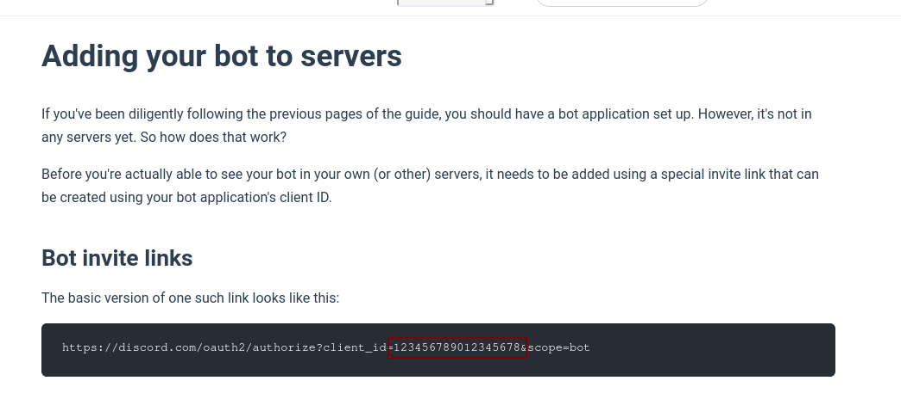
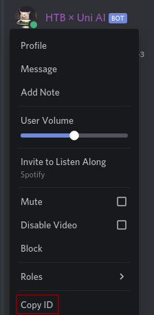
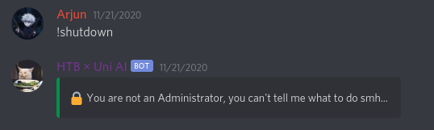
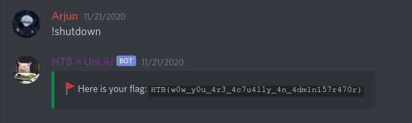

# Solution

We find documentation that outlines how to invite a discord bot to your server:

In order to move further we need the client ID of the discord bot. If we look in the #uni-ctf-misc-ai-challenge channel, we see that the bot is online, and we can copy it's id:

We put these two together and we the following link allows us to invite the bot to servers we have high privileges to:

https://discord.com/oauth2/authorize?client_id=764609448089092119&scope=bot

We successfully add the bot to server:

We attempt to shutdown and it fails because we are not an "Administrator":

We create a role named "Administrator" and add ourselves to it. Privileges are irrelevant, all that matter is that the name is named exactly as so. We try again, and we successfully get the flag:

