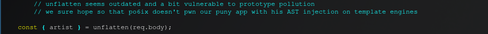
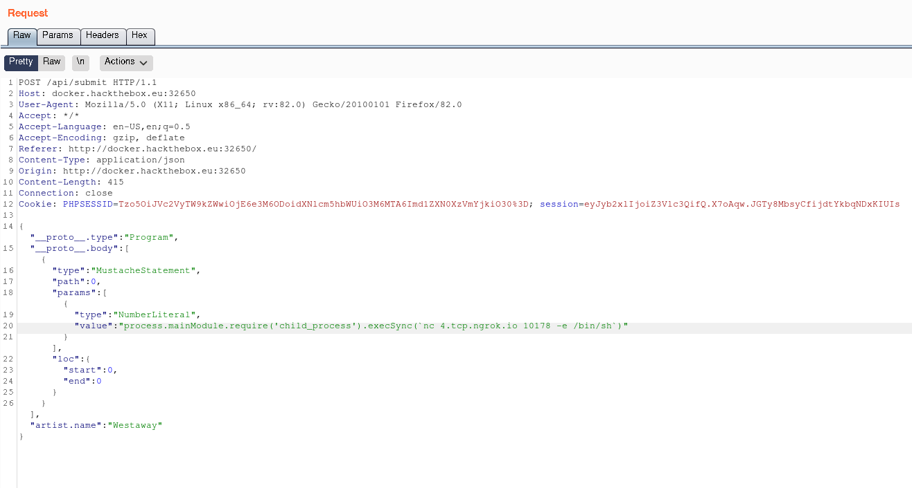
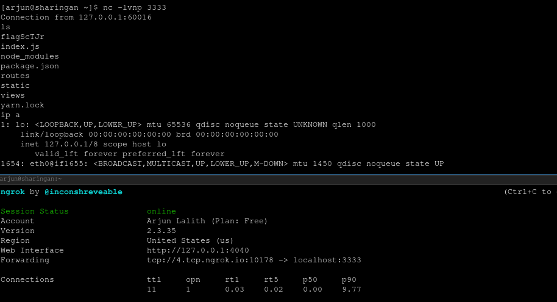
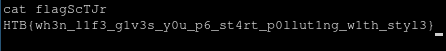

# Solution

Looking at the source code that was given, we find the following comments in the file `challenge/routes/index.js`:

We find an article outlining proof of concept of the vulnerability in conjunction with handlebar, another module being used by the webserver: https://blog.p6.is/AST-Injection/

We modify the POST request to the server in Burp Suite, such that it has both the original json, as well as the RCE json shown in the blog article:

We setup a netcat listener as well as a ngrok tunnel in order create reverse shells over the public internet. When we execute our request, we get a callback to our netcat listener:

We then `cat` the flag:

## Flag:
`HTB[wh3n_l1f3_g1v3s_y0u_p6_st4rt_p0lluting_w1th_styl3}`]